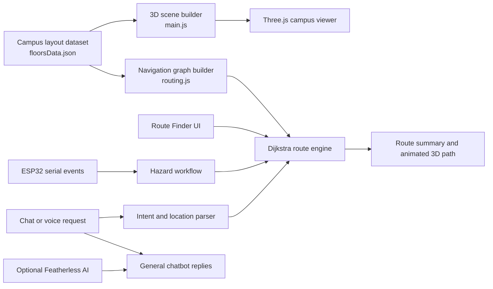

# VNRVJIET Campus Procedural Inspector

## An interactive 3D digital-twin prototype for campus navigation, hazard-aware evacuation, hardware monitoring, and conversational access

### Abstract

The **VNRVJIET Campus Procedural Inspector** is a browser-based digital-twin prototype for visualising a multi-block academic campus and supporting navigation under normal and emergency conditions. The system combines a procedural Three.js scene, a structured floor-layout dataset, a weighted graph model, Dijkstra shortest-path routing, hazard exclusion, browser serial communication for ESP32 telemetry, and a conversational interface. Users can explore the campus at macro and block levels, inspect floors and rooms, calculate routes, model hazards, and issue route requests through either text or voice transcription.

The application is intended as a demonstrator for spatial computing and emergency-response interfaces rather than a certified life-safety system. Its routing model and geometry are derived from the local dataset and hard-coded topology; deployment in a real campus requires validation against current building plans, accessibility requirements, occupancy policy, and emergency-management procedures.

**Keywords:** digital twin, 3D campus model, Dijkstra algorithm, evacuation routing, Web Serial API, ESP32, conversational interface, speech recognition, Three.js.

---

## 1. Problem statement and contribution

Large academic campuses are difficult to understand through conventional 2D maps, especially when a user must traverse multiple floors, blocks, entrances, skybridges, or temporary hazard zones. This project addresses that interaction problem through a single visual interface that joins four capabilities:

1. **Spatial context** — a navigable 3D representation of the campus and its floors, rooms, corridors, roads, entrances, and connectors.
2. **Algorithmic navigation** — graph-based routing with weighted edges, route visualisation, and exclusion of hazard nodes.
3. **Operational awareness** — optional ESP32 serial-log monitoring and a simulated fire-event workflow.
4. **Accessible interaction** — conventional controls, natural-language routing requests, and speech-to-text input for the campus chatbot.

The principal contribution is not a geographic information system or an emergency authority. It is an integrated prototype that makes the relationship between a campus layout, an evacuation graph, and user-facing assistance visible and testable in a browser.

---

## Evaluation alignment: AI That Solves a Real Problem

This repository is designed to satisfy the **AI That Solves a Real Problem** evaluation theme. It addresses the practical problem of helping students, visitors, staff, and safety operators understand a complex multi-block campus and identify a safe available route when access conditions change. The solution goes beyond a text-only chatbot: it links language and voice requests to a visual digital twin, a deterministic routing algorithm, hazard-aware rerouting, and optional physical-device telemetry.

| Evaluation condition | How this project satisfies the condition | Evidence in this repository |
| --- | --- | --- |
| **AI That Solves a Real Problem** | The project tackles campus wayfinding and emergency-route decision support, where a correct route depends on building, floor, connector, and hazard context. | `floorsData.json` models the layout; `main.js` renders the spatial context; `routing.js` computes and visualises the route. |
| **Beyond the Chatbot** | CAMPUS-AI is an interface to an operational workflow, not the full solution. Recognised route requests invoke deterministic graph search, update the route panel, and draw a 3D path. The application also includes hazard controls, a fire-event workflow, and ESP32 serial monitoring. | `chatbot.js` delegates route intent to `window._campusRouter.planRouteFromChat()`; `routing.js` builds routes, handles hazards, and integrates Web Serial. |
| **AI for Builders** | The repository provides reusable building blocks for developers and campus teams: data-driven floors, inspectable graph topology, editable weights, deterministic routing, explicit configuration templates, and a documented evaluation protocol. | `floorsData.json`, `routing.js`, `chat-config.example.js`, `server.py`, and the extension instructions in this README. |
| **Autonomous AI Workflows** | A route request initiates an end-to-end local workflow: parse user intent, resolve locations, apply identified hazards, run Dijkstra search, render the path, and return an explanation. The fire-event pathway can trigger a B-Block closure and reroute operation after operator confirmation. | `parseRoutingRequest()`, `planRouteFromChat()`, `dijkstra()`, `drawRoutePath3D()`, and `executeBBlockClosureAndReroute()` in `routing.js`. |
| **Build the Unexpected** | The project combines an interactive procedural 3D campus, hazard-aware graph routing, conversational requests, speech-to-text input, and browser-based ESP32 serial events in one lightweight browser application. | `main.js`, `routing.js`, `chatbot.js`, and `server.py`; the microphone control is defined in `index.html`. |

### Evaluation-ready demonstration path

An evaluator can verify the core workflow without an AI API key:

1. Run the local server and open the 3D campus inspector.
2. Select a route in **Route Finder**, add a hazard, and observe a hazard-aware Dijkstra route and 3D route overlay.
3. Open **CAMPUS-AI** and request a route in plain language, for example: *“I am in B-417, fire at B-Block staircase, reach the main gate safely.”*
4. Confirm that the request is handled by the local route engine, not merely answered as text.
5. Use the microphone button to dictate a request; inspect the transcription and submit it to the same route workflow.
6. Optionally connect a compatible ESP32 device in a Chromium browser, or use **Simulate Fire**, to exercise the monitored emergency pathway.

### Why the solution is credible for evaluation

- **Grounded output:** route responses are derived from a defined campus graph and active hazard set instead of being invented by a language model.
- **Actionable result:** the application returns route steps, model distance, a 3D path, and visible state changes in the interface.
- **Human oversight:** hardware-driven closure and rerouting require user confirmation; the prototype does not claim autonomous authority over a real emergency.
- **Inspectable implementation:** the data, graph construction, shortest-path logic, UI orchestration, and configuration boundaries are all available in the repository.
- **Graceful capability fallback:** normal route finding works without an AI key, speech input is optional, and unsupported browser features fail visibly rather than silently.

---

## 2. System overview



### Runtime flow

1. `index.html` loads local vendor libraries, application scripts, and the HUD.
2. `main.js` creates the WebGL scene and loads `floorsData.json`; if the request fails, it uses an inline fallback layout.
3. `routing.js` converts rooms, corridor hubs, stair segments, entrances, landmarks, roads, and selected portals into a weighted graph.
4. A route request is resolved to graph nodes, checked against active hazards, solved with Dijkstra's algorithm, and rendered in the interface and scene.
5. `chatbot.js` first attempts deterministic campus-route handling. Non-routing questions can be sent to the configured Featherless AI endpoint or the local proxy.
6. The microphone button uses the browser Web Speech API to transcribe spoken requests into the existing chat input.

---

## 3. Functional capabilities

| Capability | Implementation | User outcome |
| --- | --- | --- |
| 3D campus exploration | Three.js scene, orbit controls, macro/micro views | Pan, zoom, inspect blocks, rooms, and campus context |
| Block and level inspection | Block selector, five-level selector, floor isolation | Focus on a sector or reduce visual clutter |
| Room/status representation | Data-driven room meshes and status styling | Distinguish secure, warning, maintenance, and special areas |
| Route planning | Weighted graph and Dijkstra solver | Obtain a shortest available route between known nodes |
| Hazard-aware rerouting | Hazard set prevents traversal of affected nodes | Recalculate paths around selected or event-derived restrictions |
| 3D route display | Generated corridor waypoints and animated route geometry | Relate textual directions to the spatial model |
| ESP32 monitor | Web Serial API at 115200 baud | View compatible device logs and trigger the fire-event workflow |
| Chat assistant | Deterministic route parser plus optional Featherless AI | Ask campus questions or state routing requests naturally |
| Voice input | Web Speech API / `webkitSpeechRecognition` fallback | Dictate a request, review the transcript, then send it |

### Example route request

> I am in B-417, fire at B-Block staircase, reach the main gate safely.

For recognised route requests, the chatbot passes the request to the local routing engine. A generative model is not responsible for calculating that route; the graph solver is.

---

## 4. Routing method

### 4.1 Graph formulation

The routing layer models the campus as a weighted undirected graph \(G=(V,E)\):

- **Vertices \(V\)** represent rooms, per-floor corridor hubs, staircase segments, entrances, road junctions, landmarks, and selected inter-block portals.
- **Edges \(E\)** represent traversable room-to-corridor, corridor-to-stair, entrance-to-road, road-to-road, and skybridge/portal connections.
- **Weights** encode relative travel cost rather than surveyed physical metres. Edge categories include room-to-hub movement, stair traversal, road movement, entrances, and portals.
- **Hazards** are represented as excluded vertices. Any edge leading to an active hazard is ignored during route calculation.

The dataset's room status also affects the model: maintenance rooms are treated as hazards when the graph is built, while warning rooms receive a higher traversal cost.

### 4.2 Dijkstra shortest-path search

`routing.js` implements Dijkstra's algorithm with a custom binary min-heap priority queue. Given a start node \(s\) and destination \(t\), it repeatedly expands the unvisited node with the lowest tentative distance:

\[
d(v) \leftarrow \min\big(d(v),\; d(u)+w(u,v)\big)
\]

where \(w(u,v)\) is the edge weight. Nodes present in the active hazard set are not considered. The output is a predecessor chain, transformed into ordered route steps and a rounded total route cost. The implementation is appropriate for non-negative edge weights, which this application uses.

### 4.3 Emergency behaviour

The fire-event pathway can simulate or respond to a serial message indicating a fire condition. The interface prompts the operator to close B-Block floor access and then recalculates a route using the remaining topology. The model contains a distinct B-Block east-wing exit and stair path so that this alternative can remain available when the primary B-Block staircase compound is excluded.

### 4.4 Interpretation warning

The displayed distance is in **model units**, not certified walking distance or time. The result should be treated as a prototype recommendation only. Real evacuation guidance must account for live access conditions, crowd density, smoke, mobility needs, staff instructions, and fire-service policy.

---

## 5. Data model

`floorsData.json` is the primary external layout source. It contains a `floors` array. Each floor includes geometry and operational records such as:

- `id`, `name`, and `elevation`;
- corridor volumes defined by position and dimensions;
- rooms with identifiers, labels, spatial coordinates, dimensions, and status;
- staircase and connector information used by the rendered model.

The runtime requests this data with a cache-busting query. If it cannot be loaded, `main.js` falls back to a local inline representation, allowing the visualisation to continue in a limited offline case.

### Supported blocks and levels

The route model includes **A, B, C, D, E, and PG blocks**, with five floor levels represented in the current topology. Campus-level nodes include the main gate, VNR Circle, canteen, JSK Greens, road sections, entrances, and modelled inter-block links.

### Extending the layout safely

To add a room or alter a floor:

1. Update the relevant record in `floorsData.json`.
2. Keep each room identifier unique and use a consistent block/room naming convention.
3. Verify the room coordinates place it in the intended block; routing infers block membership from IDs and/or coordinates.
4. Add graph connections in `routing.js` when a new physical route, stairs, entrance, or bridge is introduced.
5. Test both normal routing and hazard routing after every topology change.

Geometry alone does not create a traversable route. The navigation graph must also contain the corresponding nodes and edges.

---

## 6. Conversational and voice interface

### Text assistant

The chatbot uses a campus-specific system prompt and preserves a local conversation history. It performs a deterministic routing attempt before requesting an AI response:

- If the message expresses a route, evacuation, destination, or hazard intent, `planRouteFromChat()` resolves the request against the campus graph.
- If it is not a route request, the client may use Featherless AI for a general campus response.
- If direct API access fails, it attempts the same-origin `/api/chat` proxy provided by `server.py`.

### Voice input (new)

The microphone button beside the chat field enables speech-to-text input:

1. Open **CAMPUS-AI** and select the microphone icon.
2. Grant browser microphone permission when asked.
3. Speak the request naturally.
4. The recognised text appears in the chat field, including interim speech where supported.
5. Review it and press Send, or edit it before sending.

During capture, the button becomes red and the chatbot status changes to **LISTENING... SPEAK NOW**. When recognition ends, the field is focused and the status indicates that the transcript is ready for review.

Voice support depends on `SpeechRecognition` or `webkitSpeechRecognition`; current Chromium-based browsers generally provide the most reliable experience. Browsers that do not expose either API leave the microphone control disabled and retain full keyboard interaction.

---

## 7. ESP32 integration

The hardware monitor uses the browser Web Serial API. A compatible device can be selected by the user and opened at **115200 baud**. Incoming serial lines are displayed in the interface and are inspected for the configured fire-event condition.

### Browser and safety requirements

- Web Serial support is primarily available in Chromium-family browsers.
- The user must explicitly select the serial device; the application cannot connect silently.
- A physical fire-detection deployment requires robust device firmware, authenticated telemetry, fault monitoring, power resilience, and independent certified emergency systems.
- The simulated alert and route closure in this repository are for demonstration and testing.

---

## 8. Architecture and repository guide

| File | Role |
| --- | --- |
| `index.html` | Application shell, controls, HUD, route UI, hardware modal, chatbot, and script order |
| `style.css` | Responsive sci-fi/glass UI styling, route panel, chat panel, microphone listening state, and animations |
| `main.js` | Three.js scene creation, procedural campus geometry, data loading, controls, picking, labels, floor isolation, macro/micro transitions |
| `floorsData.json` | External layout and room data used to build the model |
| `routing.js` | Weighted graph, min-heap, Dijkstra solver, hazard model, 3D route rendering, route UI, serial integration, and chat-route parser |
| `chatbot.js` | Chat UI, route hand-off, AI requests, error handling, and browser speech recognition |
| `server.py` | Static-file server and optional same-origin Featherless AI proxy |
| `chat-config.example.js` | Safe template for client-side AI configuration |
| `chat-config.js` | Local AI configuration; intentionally ignored by Git and should never contain a published key |
| `.env` | Local server-side configuration; intentionally ignored by Git |
| `three.min.js`, `OrbitControls.js`, `gsap.min.js` | Vendored browser dependencies |
| `drive-download-*.zip` | Source archive retained with the workspace; not required at runtime |

### Script loading order

The application relies on this order:

1. Three.js
2. OrbitControls
3. GSAP
4. chat configuration
5. scene application (`main.js`)
6. routing layer (`routing.js`)
7. chatbot (`chatbot.js`)

This matters because the routing layer and chatbot consume globals created by earlier scripts.

---

## 9. Installation and local execution

### Prerequisites

- Python 3.9 or later for the included server.
- A modern browser with WebGL enabled.
- Chrome or Edge is recommended for voice recognition and Web Serial features.
- A Featherless API key only if general AI replies are required.

### Recommended secure configuration

1. Copy `chat-config.example.js` to `chat-config.js` only if you explicitly need client-side configuration. Do not commit it.
2. Prefer server-side configuration by creating a local `.env` file:

```env
FEATHERLESS_API_KEY=replace_with_your_key
FEATHERLESS_MODEL=Qwen/Qwen2.5-7B-Instruct
PORT=5500
```

3. Start the application from the repository directory:

```powershell
python server.py
```

4. Open `http://localhost:5500/index.html`.

The local server is required for the `/api/chat` proxy. A generic static server can display the 3D campus, but it will not provide the proxy endpoint.

### Do not expose secrets

`chat-config.js` and `.env` are listed in `.gitignore`. Keep API keys only in local ignored files or a server-side secret manager. If a key has ever been placed in a tracked file, browser console, screenshot, chat transcript, or public repository, revoke and replace it.

---

## 10. User workflow

### Explore the campus

1. Open the menu and choose a block.
2. Select a floor, then optionally enable **Isolate Active Level**.
3. Use pointer controls to orbit, pan, and zoom.
4. Select the macro-return control to return to the campus-wide perspective.

### Plan a route

1. Open **Route Finder**.
2. Choose a **From** node and a **To** node.
3. Add known hazards when appropriate.
4. Select **Find Route**.
5. Read the route steps and inspect the animated 3D path.

### Ask by chat or voice

1. Open **CAMPUS-AI**.
2. Type a route request or use the microphone button.
3. Review the recognised voice text if applicable.
4. Send the message. Recognised navigation requests are solved locally by the route engine.

---

## 11. Evaluation plan

The repository does not currently include a formal experimental dataset or study results. The following protocol is suitable for an academic evaluation.

| Research question | Measure | Suggested method |
| --- | --- | --- |
| Does the graph return valid routes? | Path existence, node/edge validity, route cost | Construct expected normal and blocked-route test cases from approved floor plans |
| Does hazard handling prevent unsafe paths? | Hazard-node avoidance rate | Inject single and multiple hazards, then assert no returned path includes an excluded node |
| Does the visual route match the solver output? | Step-to-render consistency | Compare route steps with rendered waypoints in repeated scenarios |
| Is the interface usable for first-time visitors? | Task completion, time, SUS/UMUX-Lite | Conduct a moderated usability study with students, visitors, and staff |
| Does speech input improve access? | Recognition accuracy, correction rate, completion time | Compare typed and spoken requests across accents, noise levels, and route vocabulary |
| Is the system performant enough? | Initial load, frame rate, route latency | Profile on representative desktop and mobile hardware |

### Recommended test scenarios

- Room-to-room navigation within the same block and floor.
- Multi-floor navigation requiring stairs.
- Cross-block navigation through modelled skybridges.
- Main-gate routing with and without temporary hazards.
- B-Block fire-event rerouting through permitted alternatives.
- Ambiguous spoken room identifiers and correction behavior.
- Browser capability fallbacks: no Web Serial, no speech recognition, microphone denied, API unavailable, and missing data file.

---

## 12. Limitations and future work

### Current limitations

- The 3D model and graph are a prototype; they are not a surveyed, real-time, or certified representation of the campus.
- Route costs are relative model weights rather than calibrated walking times, accessibility costs, or live congestion estimates.
- Hazard detection is simulated or depends on browser-connected serial input; it is not an authenticated production telemetry pipeline.
- Speech recognition availability, language support, and recognition quality are browser- and network-dependent.
- Direct client-side AI keys are inherently exposed to users of the page; use the server-side proxy for safer deployments.
- The application is implemented as global browser scripts rather than modular, typed components, which increases coupling as the project grows.

### Future research and engineering directions

- Validate geometry and routing topology with campus facilities staff and emergency officers.
- Replace relative weights with measured path lengths, accessibility constraints, and dynamic crowd/closure data.
- Add role-based event management, authenticated device registration, audit logs, and secure telemetry transport.
- Use a backend graph service for larger topologies and live routing updates.
- Introduce automated unit tests for parser, graph, and hazard cases; add end-to-end browser tests for key journeys.
- Add multilingual, offline, and text-to-speech interaction modes.
- Improve accessibility with keyboard route selection, contrast testing, screen-reader labels, and nonvisual route summaries.

---

## 13. Reproducibility checklist

- [x] Local 3D dependencies are included in the repository.
- [x] External floor data is included as JSON.
- [x] An inline data fallback exists for the visualisation.
- [x] The routing algorithm and weights are inspectable in source.
- [x] Configuration templates are provided without requiring a committed API key.
- [x] Voice input degrades gracefully when browser support is unavailable.
- [ ] Formal test suite and benchmark results are included.
- [ ] Independently validated campus measurements and emergency-policy approval are included.

---

## 14. References and technical foundations

1. E. W. Dijkstra, “A Note on Two Problems in Connexion with Graphs,” *Numerische Mathematik*, 1959.
2. Three.js, browser 3D rendering library: <https://threejs.org/>.
3. Web Serial API specification and browser guidance: <https://developer.mozilla.org/docs/Web/API/Web_Serial_API>.
4. Web Speech API guidance: <https://developer.mozilla.org/docs/Web/API/Web_Speech_API>.

---

## License and responsible-use note

No license file is currently included. Add a clear license before public distribution.

This project must not replace emergency signage, trained personnel, or instructions issued by campus authorities and emergency services. Treat all evacuation output as a prototype aid until it has been formally validated, governed, and approved for operational use.
